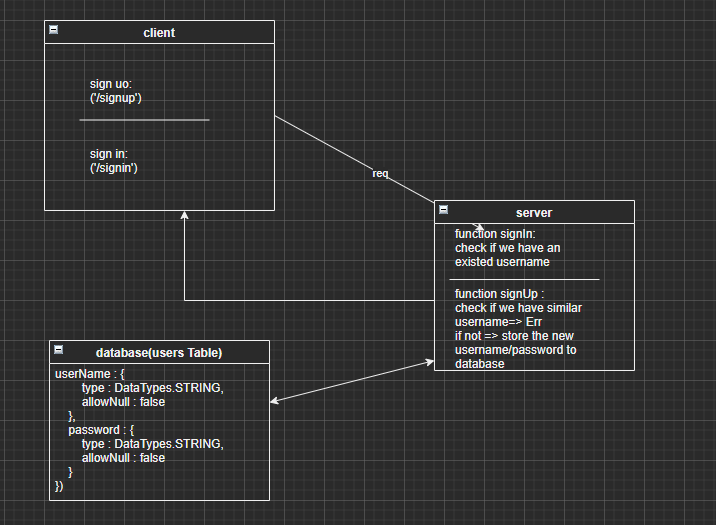

# basic-auth

## LAB - 06 BASIC AUTH

* Author: Maram Abu Murad
* [Heroku link]()
* Setup .env requirements PORT - 3000
* Running the app npm index.js
* Endpoint: /signin  /signupEndpoint : '*' returns ERROR * 'Page NOT FOUND.' Endpoint : /badConnection Returns Object { "error": 500, "path": "/badConnection", "message": "Something WENT WRONG Internal Server Error" }
*  